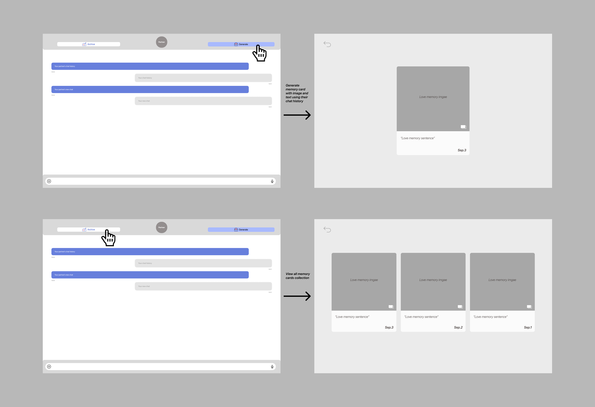

# Amimi CoupleMemory Concept

## Overview

This assignment implements a concept for helping long-distance couples document and reflect on their daily conversations by creating visual memories. The concept supports both manual memory creation (without AI) and AI-augmented generation using Google's Gemini models.

## Concept Specification

### Original Concept (Non-AI)

```
concept CoupleMemory

purpose
    help long-distance couples document and reflect on their daily conversations

principle
    after a conversation transcript, the couple can manually create a memory entry
    with summary, reflection message, and feedback for each person;
    they can also manually specify elements to include in a visual collage

state
    Transcript (text: String)
    MemoryEntry:
        summary: String
        lovelyMessage: String
        amyFeedback: String
        jayFeedback: String
    ImageData:
        base64Content: String
        format: String

actions
    loadTranscript(text: String)
    createMemoryManually(summary, lovelyMessage, amyFeedback, jayFeedback): MemoryEntry
    createCollageManually(elements: String[]): ImageData
    displayMemory(): void
    saveMemory(filename: String): void
```

### AI-Augmented Concept

The AI augmentation adds two LLM-powered actions while preserving all manual functionality:

```
actions
    async generateReflection(llm: GeminiLLM)
        requires transcript is set
        effect uses LLM to generate reflection from transcript
    
    async generateCollage(llm: GeminiLLM)
        requires reflection exists with summary
        effect uses LLM to generate collage image from summary
```

**Key Design Decision**: The original concept functionality is preserved. Users can still manually create memories, and the AI augmentation provides automation without removing the manual workflow. This ensures the concept works even without AI capabilities.

## User Interaction Design



*The image above illustrates the complete user interaction flow for generating and viewing memory cards from chat history.*

### User Journey

The typical user journey begins when a long-distance couple completes a phone call or video chat. They want to capture and reflect on their conversation as a "memory" - both a textual reflection and a visual collage.

**Step 1: Input**
- User opens Amimi app
- Selects "Create New Memory"
- System shows two options: "Upload Transcript" or "Paste Transcript"

**Step 2: Transcript Entry**
- User pastes or uploads conversation transcript (format: "Amy: ... Jay: ...")
- System validates transcript format
- User proceeds to memory creation

**Step 3: Memory Generation (AI Mode)**
- User chooses "AI Generate" option
- System sends transcript to LLM with prompt asking for summary, lovely message, and constructive feedback
- **LLM Context**: Full transcript text
- **LLM Output**: JSON with `summary`, `lovely_message`, `amy_feedback`, `jay_feedback`
- System displays generated reflection with edit option

**Step 4: Collage Generation (AI Mode)**
- User selects "Generate Visual" after reflection is created
- System sends reflection summary to image generation LLM
- **LLM Context**: Summary text + style guidance (pixel art, warm colors)
- **LLM Output**: Base64-encoded PNG image
- System displays collage with regenerate option

**Step 5: Review and Edit**
- User can edit any generated content
- User can regenerate reflection or collage if not satisfied
- User saves memory to their collection

**Alternative Journey (Manual Mode)**:
- User can skip AI and manually write summary, message, and feedback
- User can manually describe collage elements or upload their own image

### Annotations on Interaction Flow

```
┌─────────────────────────────────────────────────────────┐
│ User Action: Paste Transcript                          │
│                                                         │
│ Transcript Text ─────┐                                  │
│                     ▼                                   │
│         ┌──────────────────────┐                       │
│         │  LLM Processes       │                       │
│         │  Prompt: "You are   │                       │
│         │  Amimi, analyze     │                       │
│         │  this transcript"    │                       │
│         └───────────┬──────────┘                       │
│                     │                                   │
│                     ▼                                   │
│           Output: {                                     │
│             "summary": "...",                           │
│             "lovely_message": "...",                   │
│             "amy_feedback": "...",                     │
│             "jay_feedback": "..."                      │
│           }                                             │
│                     │                                   │
│                     ▼                                   │
│         ┌──────────────────────┐                       │
│         │  Display to User     │  ← User can edit     │
│         │  - Summary           │   or regenerate      │
│         │  - Lovely Message    │                       │
│         │  - Amy Feedback      │                       │
│         │  - Jay Feedback      │                       │
│         └──────────────────────┘                       │
└─────────────────────────────────────────────────────────┘
```

## Implementation

### Setup

```bash
# Install dependencies
npm install

# Create config file
cp config.json.template config.json
# Edit config.json and add your Gemini API key

# Build and run tests
npm start
```

### Running Tests

```bash
# Run all tests
npm start

# Or build first, then run
npm run build
node dist/memory-tests.js
```

### Key Files

- `memory.spec` - Concept specification
- `memory-concept.ts` - Main concept implementation
- `gemini-llm.ts` - LLM wrapper for Gemini API
- `memory-tests.ts` - Test driver with multiple test cases

## Test Case Experiments

### Challenging Test 1: Very Short Transcript

**Scenario**: User pastes a transcript with minimal content (4 lines, just greetings and "I love you")

**Approach**: Test if LLM can generate meaningful feedback with very little context to work with.

**What worked**: The LLM still managed to extract emotional significance from the brief interaction, generating appropriate feedback about the simplicity being meaningful and suggesting deeper future conversations.

**What went wrong**: 
- Initial prompt produced generic feedback ("have deeper conversations") without specificity
- Summary was sometimes too brief even for the short input

**Issues remaining**: Need more explicit instruction to handle edge cases where transcript is minimal but emotionally significant.

**Prompt variants tried**:
1. **Original**: "Summarize in detail what Amy and Jay talked about"
   - **Issue**: Too brief transcripts result in very short summaries
   - **Fix**: Added "extract emotional significance even from brief exchanges"

2. **Variant 1**: "Summarize the conversation, noting that even brief exchanges can hold meaning"
   - **Result**: Better at appreciating the simplicity
   - **Still fails**: Sometimes fails to generate substantive feedback

3. **Variant 2**: "Focus on the emotional content and relationship dynamics, even in short conversations"
   - **Result**: Most effective at generating meaningful feedback
   - **Adopted**: This variant is used in the final prompt

---

### Challenging Test 2: Transcript with Emotional Complexity

**Scenario**: User pastes transcript showing Amy expressing vulnerability and worries about being "too needy," with Jay providing reassurance

**Approach**: Test if LLM provides constructive, supportive feedback vs. overly critical or dismissive responses.

**What worked**: The LLM generally provided supportive feedback, validating Amy's feelings while offering constructive suggestions. Jay's feedback appropriately praised his supportive responses.

**What went wrong**:
- Occasionally generated feedback that could be interpreted as "you're doing fine, nothing to improve" which isn't actionable
- Sometimes feedback lacked the specificity needed to be truly helpful

**Issues remaining**: Balancing validation with actionable advice - need to ensure feedback is supportive but still offers concrete suggestions for growth.

**Prompt variants tried**:
1. **Original**: "Offer one constructive suggestion"
   - **Issue**: Sometimes too vague ("keep being supportive")
   - **Fix**: Emphasized "actionable and specific"

2. **Variant 1**: "Provide concrete, specific suggestions they can implement"
   - **Result**: Better specificity
   - **Still fails**: Can be too prescriptive

3. **Variant 2**: "Offer gentle, specific ways to enhance their communication"
   - **Result**: Best balance of being supportive and actionable
   - **Adopted**: This tone and structure works best

---

### Challenging Test 3: Transcript with Many Topics

**Scenario**: User pastes a long transcript covering multiple distinct topics (test results, parent visit planning, trip planning, cafe discovery, expressions of missing each other)

**Approach**: Test if LLM can create a comprehensive summary that captures all topics vs. selectively summarizing only a few.

**What worked**: The LLM successfully identified all major topics and created a coherent summary that flowed between them, not just listing them.

**What went wrong**:
- Sometimes summary would focus on 2-3 topics and miss others
- Summary could become too long and lose coherence
- Feedback sometimes only addressed one aspect of the conversation

**Issues remaining**: Need to ensure balance between comprehensiveness and conciseness - capturing all topics without overwhelming length.

**Prompt variants tried**:
1. **Original**: "Summarize in detail"
   - **Issue**: Too detail-oriented, missed the forest for the trees
   - **Fix**: Clarified "detailed yet concise"

2. **Variant 1**: "Create a comprehensive summary covering all major topics discussed"
   - **Result**: Better coverage but sometimes too long
   - **Still fails**: Can lack flow between topics

3. **Variant 2**: "Summarize the conversation's content and flow, noting major topics while maintaining narrative coherence"
   - **Result**: Best at balancing coverage with readability
   - **Adopted**: This approach produces most useful summaries

---

## Validators

The implementation includes three validators to catch common LLM output issues:

### Validator 1: JSON Structure Validation

**Issue**: LLM sometimes returns incomplete JSON fields or uses wrong field names (e.g., "summary_text" instead of "summary").

**Detection**: 
- Checks that all required fields exist: `summary`, `lovely_message`, `amy_feedback`, `jay_feedback`
- Verifies each field is a non-empty string
- Enforces minimum summary length (20 characters)

**Impact**: Prevents crashes when trying to access missing fields, ensuring the system always has complete data.

**Code Location**: `parseAndApplyReflection()` method in `memory-concept.ts`, lines 190-214

### Validator 2: Feedback Appropriateness

**Issue**: LLM sometimes generates overly generic feedback ("you're doing great") or feedback that lacks actionable suggestions, which doesn't help users improve their communication.

**Detection**:
- Checks that feedback contains actionable language ("could", "try", "consider", "might", "suggest", "maybe")
- Validates that feedback isn't just validation without concrete suggestions
- Filters out inappropriate harsh language

**Impact**: Ensures feedback is actually helpful and constructive, not just "everything is fine" or overly critical.

**Code Location**: `parseAndApplyReflection()` method, lines 214-224, plus helper methods `containsActionableSuggestions()` (lines 330-334) and `containsHarshLanguage()` (lines 336-340)

### Validator 3: Image Data Validation

**Issue**: Image generation API might return empty data, wrong format, or suspiciously small files that indicate generation failure.

**Detection**:
- Verifies that response contains parts with inline data
- Checks that base64 content exists and is non-empty
- Enforces minimum file size threshold (1KB) to catch obviously failed generations
- Validates that data format is valid base64

**Impact**: Prevents saving corrupted or empty images, ensuring users get a valid visual memory.

**Code Location**: `parseAndApplyCollage()` method, lines 226-256

---

## Summary

This implementation successfully demonstrates a concept that can work both with and without AI augmentation. The manual workflow is preserved, ensuring the concept remains functional even when AI capabilities are unavailable. The AI augmentation adds significant value by automating the reflection generation and collage creation, with robust validation to ensure quality outputs.

